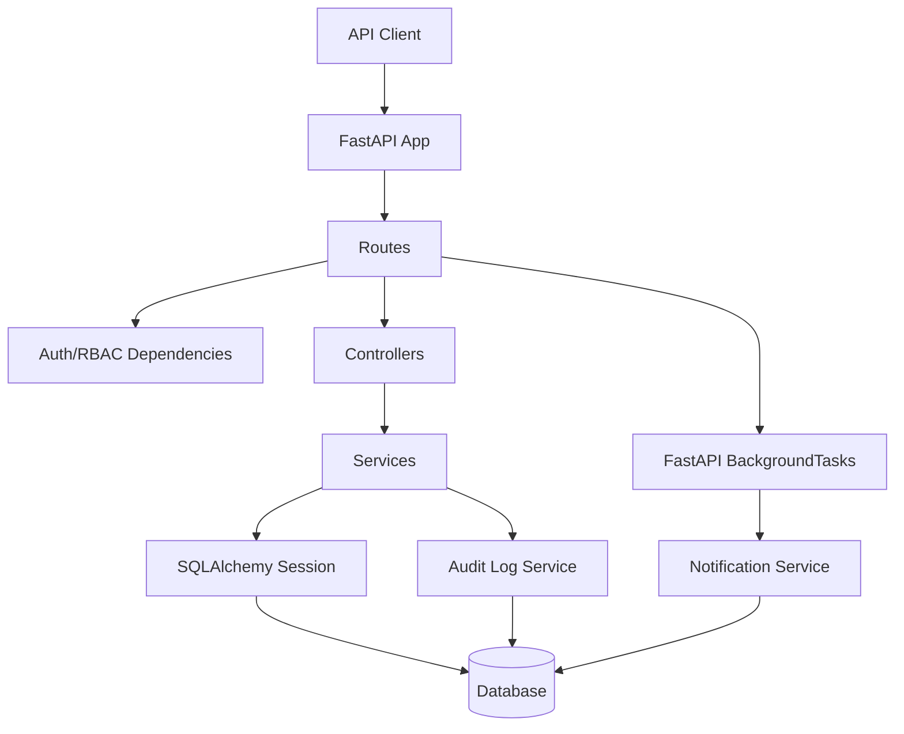

# Architecture Diagram

## Layers

- `routes/`: HTTP endpoints and dependency injection
- `controllers/`: task response orchestration and HTTP error translation
- `services/`: business rules, database operations, audit and notification helpers
- `models/`: SQLAlchemy ORM entities and relationships
- `schemas/`: Pydantic request and response models
- `security.py`: password hashing, bearer token creation/validation, RBAC dependencies
