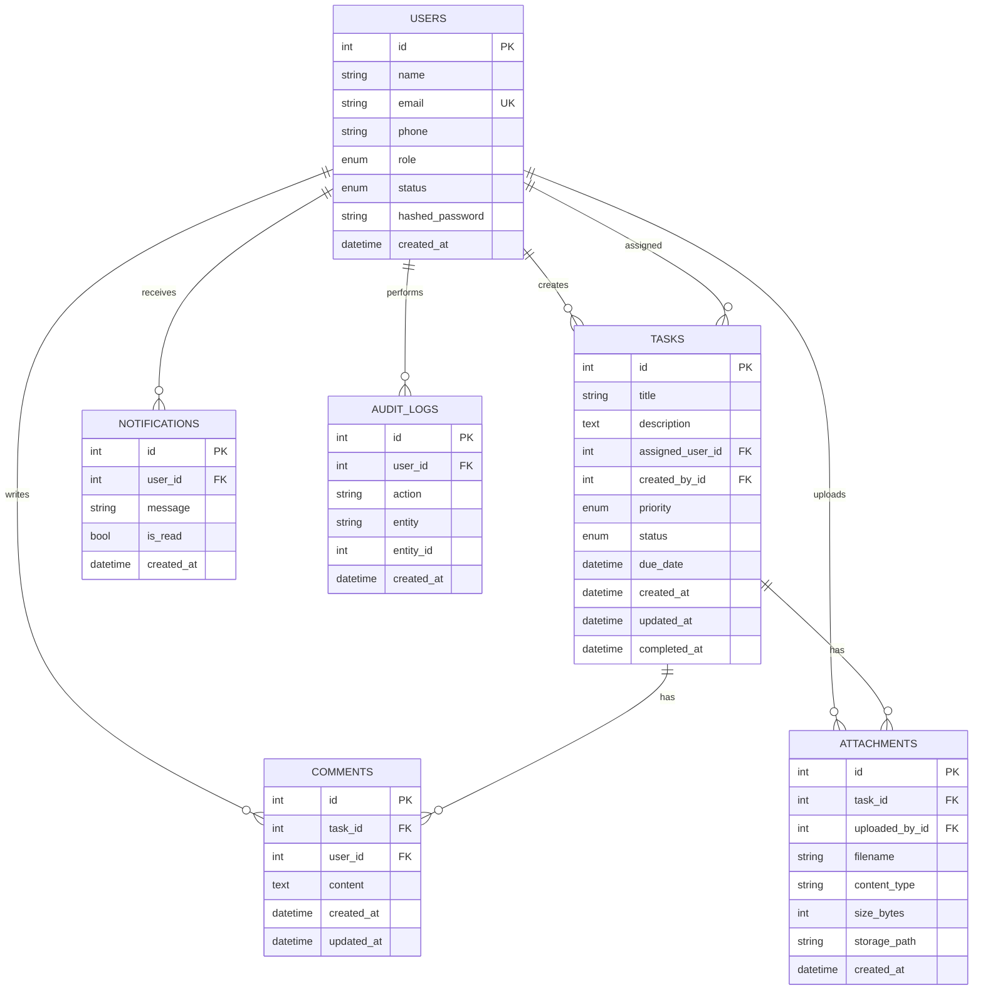

# Database Schema Diagram

```mermaid
erDiagram
    USERS ||--o{ TASKS : creates
    USERS ||--o{ TASKS : assigned
    USERS ||--o{ COMMENTS : writes
    USERS ||--o{ ATTACHMENTS : uploads
    USERS ||--o{ NOTIFICATIONS : receives
    USERS ||--o{ AUDIT_LOGS : performs
    TASKS ||--o{ COMMENTS : has
    TASKS ||--o{ ATTACHMENTS : has

    USERS {
        int id PK
        string name
        string email UK
        string phone
        enum role
        enum status
        string hashed_password
        datetime created_at
    }

    TASKS {
        int id PK
        string title
        text description
        int assigned_user_id FK
        int created_by_id FK
        enum priority
        enum status
        datetime due_date
        datetime created_at
        datetime updated_at
        datetime completed_at
    }

    COMMENTS {
        int id PK
        int task_id FK
        int user_id FK
        text content
        datetime created_at
        datetime updated_at
    }

    ATTACHMENTS {
        int id PK
        int task_id FK
        int uploaded_by_id FK
        string filename
        string content_type
        int size_bytes
        string storage_path
        datetime created_at
    }

    NOTIFICATIONS {
        int id PK
        int user_id FK
        string message
        bool is_read
        datetime created_at
    }

    AUDIT_LOGS {
        int id PK
        int user_id FK
        string action
        string entity
        int entity_id
        datetime created_at
    }
```
